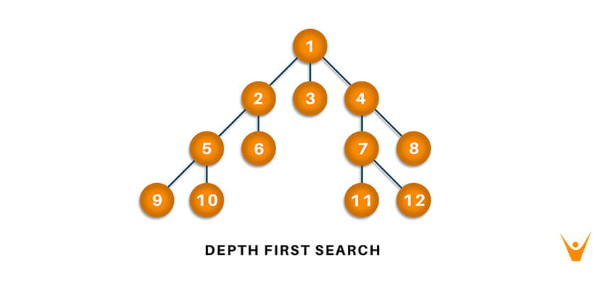

# Summer of Bitcoin

> A global program that matches students with open source, free software and technology-related organizations working on bitcoin to write code and become part of these communities while making some BTC along the way!
> For futher info [_here_](https://summerofbitcoin.org). <!-- If you have the project hosted somewhere, include the link here. -->
# Code challenge for Summer of Bitcoin 2021
## Table of Contents
* [Problem Statement](#problem-statement)
* [Technologies Used](#technologies-used)
* [Installation](#installation)
* [Usage](#usage)
* [Data Extraction](#data-extraction)
* [Approach 1 (Brute Force)](#approach-1-brute-force)
* [Approach 2 (Knapsack Problem)](#approach-2-knapsack-problem)
* [Final Approach (Most Optimal)](#final-approach-most-optimal)
* [Room for Improvement](#room-for-improvement)
* [References](#references)
* [Acknowledgements](#acknowledgements)
* [Contact](#contact)
<!-- * [License](#license) -->

## Problem Statement
You can get the complete problem statement [sb_README.pdf](https://github.com/abhshkvrm/Summer-of-Bitcoin/blob/739f2efc771380a3d20fc2c0eda4bd714098acc9/sb_README.pdf)
    
 File [mempool.csv](https://github.com/abhshkvrm/Summer-of-Bitcoin/blob/be6533226bfcfc8ba771bdb13df8031fb34efbe8/mempool.csv) contains transactions in the memory pool and we need to find the optimal transactions to process. 
 The file contains : 
   - transaction id
   - Fee
   - Weight 
   - Parent transaction id (few)

<b>Constraint :</b>

   - The total weight of transactions in a block must not exceed `4,000,000` weight. For this exercise assume that there is no coinbase transaction.
   - A transaction may only appear in a block if all of its parents appear earlier in the block.

<b> Task: </b>
   - The output from the program should be txids, separated by newlines, which make a valid block, maximizing the fee to the miner. Transactions **MUST** appear in order
(no transaction should appear before one of its parents)
 
<!-- You don't have to answer all the questions - just the ones relevant to your project. -->

## Technologies Used
- Jupyter Notebook
- Python 3
- VS Code
- Ubuntu Operating System

## Installation
You can find the installation documentation for the
[Jupyter platform, on ReadTheDocs](https://jupyter.readthedocs.io/en/latest/install.html).
The documentation for advanced usage of Jupyter notebook can be found
[here](https://jupyter-notebook.readthedocs.io/en/latest/).

For a local installation, make sure you have
[pip installed](https://pip.readthedocs.io/en/stable/installing/) and run:

    $ pip install notebook

## Usage 

### Running in a local installation

Launch with:

    $ jupyter notebook

### Running in a remote installation

You need some configuration before starting Jupyter notebook remotely. See [Running a notebook server](https://jupyter-notebook.readthedocs.io/en/stable/public_server.html).

 

## Data Extraction

              def read():
                  with open("mempool.csv", "r") as f:                              
                       for line in f.readlines()[1:]:                                
                           tx_id, fe, wgt, parents = line.strip().split(",")     
                           fe, wgt = int(fe), int(wgt) 
                           ....
                              
           

<!-- If you have screenshots you'd like to share, include them here. -->
 

# Approach 1 (Brute Force)
We can call it a Brute force approach or a recursive apporach rather. In this approach we will take every possible combination of parent and children satisfying the given condition and will do it using brute force method. On analyzing the dataset it is more than 5000 and taking the worst case time complexity it will be `O(2^n)` which is approximately 2^5000 which I don't think I will be able to solve in my PC. So rather than wasting time on this I prefered other method. Though it will work perfectly in small dataset. Moving on to the next approach.
 

# Approach 2 (Knapsack Problem)

This approach is more optimal in comparison to the Brute force or recursive that we have discussed above. Seeing this problem and analyzing no one can deny it is the standard 0-1 Knapsack Problem. So I have attempted to solve the problem using this approach. In this approach, I have just ignored the parent and children relationship for a moment and only encountered three things, i.e., `transaction_id`, `weight`, `fees`, and the `total weight`. To get a better feel of what I have done, kindly visit the code `Approach_2.py` or the notebook [Approach2.ipynb](https://github.com/abhshkvrm/Summer-of-Bitcoin/blob/be6533226bfcfc8ba771bdb13df8031fb34efbe8/Approach_2.ipynb). The source code of the above approach which I have followed is [this](https://www.geeksforgeeks.org/python-program-for-dynamic-programming-set-10-0-1-knapsack-problem/)

## What is Knapsack Problem ?

The `knapsack problem` is a problem in combinatorial optimization: Given a set of items, each with a weight and a value, determine the number of each item to include in a collection so that the total weight is less than or equal to a given limit and the total value is as large as possible. Yeah you heard it right! This is the problem statement that we are having inspite having extra condition of parent children relationship. 

`0-1` Knapsack cannot be solved by Greedy approach. Greedy approach does not ensure an optimal solution. In many instances, `Greedy` approach may give an optimal solution.

### Pseudo Code of 0-1 Knapsack 

                 Dynamic-0-1-knapsack (v, w, n, W) 
                 for w = 0 to W do 
                    c[0, w] = 0 
                 for i = 1 to n do 
                    c[i, 0] = 0 
                    for w = 1 to W do 
                       if wi ≤ w then 
                          if vi + c[i-1, w-wi] then 
                              c[i, w] = vi + c[i-1, w-wi] 
                           else c[i, w] = c[i-1, w] 
                       else 
                           c[i, w] = c[i-1, w] 

### Time Complexity of Knapsack

This algorithm takes `θ(n, w)` times as the matrix K in the code  has `(n + 1).(w + 1)` entries, where each entry requires` θ(1) `time to compute.

## Problem Faced
Though I don't get not much hint how to include the parent children relationship in the standard knapsack, I tried many stuffs but ended up getting nothing. Also the data set is too big I can't even take the max_weight to be 4000000 (given in the problem statement) it throws Memory error. I have run my code taking it to be 40000

## Results
I have printed the list of txis which we will get on doing simple Knapsack problem approach but for the smaller 

 

# Final Approach (Most Optimal)

In the problem statement, there are also dependencies, i.e., the parent transaction, as we have to maximize the fee to the miner while having the constraint in weights. Somehow, I thought of minimizing the weight/fees ratio, i.e., the fees should be higher, and the weight should be lower. And we only need as many small values of this ratio as possible. Still, in my opinion, the problem is also dependencies, or as per my hypothesis, I can't do this by **greedy** approach. Hence, I have to take something different, and we have to encounter the dependencies, so we have to link the dependencies, which we can do quickly using graphs. With a decent level of knowledge of graphs, I studied **DFS** and got the basic idea that parents have to be processed first, then children as per the problem statement. So I have to build a somehow recursive DFS solution that ensures proper ordering, for deep information visit [FinalCode.ipynb](https://github.com/abhshkvrm/README-cheatsheet/blob/71d887723360e84629a5c0bb5f887169e4d0dcdd/Untitled1.ipynb) . The arrangement is made by considering the fact of minimizing the weight/fees ratio!

## Depth First Search Algorithm

**Depth-first search (DFS)**, is an algorithm for tree traversal on graph or tree data structures. It can be implemented easily using recursion and data structures like dictionaries and sets. Pick any node. If it is unvisited, mark it as visited and recur on all its adjacent nodes. Repeat until all the nodes are visited, or the node to be searched is found.

### Pseudo Code of DFS

     DFS(G, u)
         u.visited = true
         for each v ∈ G.Adj[u]:
             if v.visited == false
                 DFS(G,v) 

     init() {
        For each u ∈ G
           u.visited = false
        For each u ∈ G
           DFS(G, u)
        
       }

### Time Complexity of DFS
The time complexity of the Depth-First Search algorithm is represented within the sort of `O(V+E)`, where V is that the number of nodes and E is that the number of edges.

The space complexity of the algorithm is `O(V)`.

## Results

You can look at the code in the jupyter notebook, which gives a better insight into what I have done at `final_approach.ipynb` or `final_approach.py`. By applying the above approach, I got the `block.txt` which contains the txids, separated by newlines, which make a valid block, maximizing the fee to the miner. Some of the different results are as follows, which give some highlights of what I have done.

    Total number of transaction in the final block: 3177
    Total weight of the final block: 3999136
    Total(maximum) fees of the final block: 5704305
    Percentage of weight in the final block: 99.9784%

This approach is not the best or I don't know but provides the maximum at some extent under the stated condition Here deciding factor is the ratio between fee and weight  `(weight/fees)` and also taking care of that its parents and children relationship.
 

## Room for Improvement
There are many areas where I think there can be improvement.

Room for improvement:
- There is always the chance of improvement in the above approaches that I have listed. There might be many such approaches
- Approach 2 of `Knapsack` can be improved, or I should try to see and encounter the parent-children relationship. The code can be much more structured.
- In the case of naive approach, but with a higher computational power ,the algo will return the best possible results (independent of input, which is not the case while using a naive approach). Hence there is always some tradeoff.

To do:
- We can definitely improve the quality of the code. 
- Maybe in Approach 2, I can select the highest value of fee or weight then check if the selected transaction is valid or, i.e., the parent is already included in the block. If the transaction is valid, include the transaction, update fee, and weight, and remove the current set of detailed data. If not right, then move to the next transaction. Further, we can try to get the maximum value of fee/weight.

## References
These are some of the valuable resources that I have referred:
- [Knapsack Problem YouTube](https://www.youtube.com/watch?v=8LusJS5-AGo")
- [Knapsack Problem GFG](https://www.geeksforgeeks.org/0-1-knapsack-problem-dp-10/")
- [Optimal Mining: Maximizing Bitcoin Miners’ Revenues](https://hal.archives-ouvertes.fr/hal-03232783/document)
- [The knapsack problem with neighbour constraints](https://www.sciencedirect.com/science/article/pii/S1570866712000809)
- [Depth First Search in Python (with Code) | DFS Algorithm](https://favtutor.com/blogs/depth-first-search-python#:~:text=Traversal%20means%20that%20visiting%20all,graph%20or%20tree%20data%20structure.)
- [Depth First Search or DFS for a Graph GFG](https://www.geeksforgeeks.org/depth-first-search-or-dfs-for-a-graph/)
- [Mempool](https://mempool.space)
- [DFS YouTube](https://www.youtube.com/watch?v=QVcsSaGeSH0)

## Acknowledgements

- Many thanks to **Adi**, **Caralie**, **Jonas**, and the whole team of Summer of Bitcoin for giving me this opportunity. I learned a lot in the past 60 hours.

## Contact
Created by [Abhishek](https://github.com/abhshkvrm) - feel free to contact me!
 
Mail :    `abhivrm@iitk.ac.in`
 
Phone no :  `+91-8957934462`
 
Sophomore Undergraduate,
 
Indian Institute of Technology Kanpur

<!-- Optional -->
<!-- ## License -->
<!-- This project is open source and available under the [... License](). -->

<!-- You don't have to include all sections - just the one's relevant to your project -->
